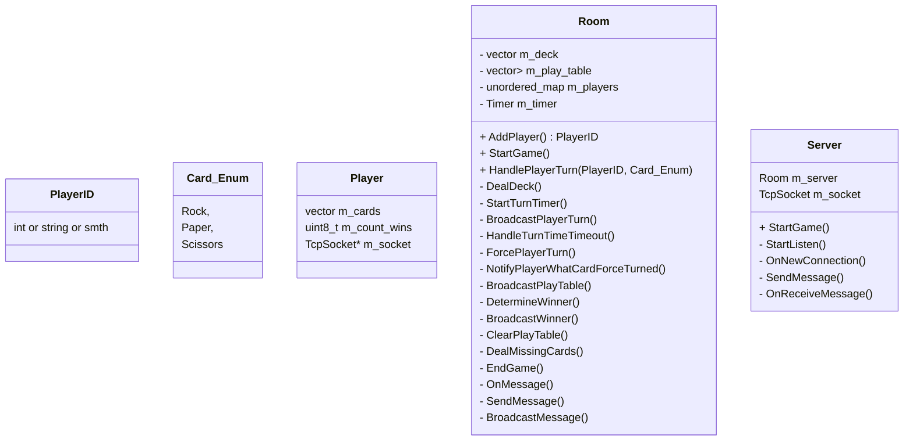

```mermaid
classDiagram
    class PlayerID {
        int or string or smth
    }

    class Card_Enum {
        Rock,
        Paper,
        Scissors
    }

    class Player {
        vector<Cards> m_cards
        uint8_t m_count_wins
        TcpSocket* m_socket
    }

    class Room {
        + AddPlayer() PlayerID
        + StartGame()

        + HandlePlayerTurn(PlayerID, Card_Enum)
        
        - DealDeck()
        - StartTurnTimer()

        - BroadcastPlayerTurn()

        - HandleTurnTimeTimeout()
        - ForcePlayerTurn() 
        - NotifyPlayerWhatCardForceTurned()
        - BroadcastPlayTable()
        - DetermineWinner()
        - BroadcastWinner()
        - ClearPlayTable()
        - DealMissingCards()

        - EndGame()

        - OnMessage()
        - SendMessage()
        - BroadcastMessage()

        - vector<Cards> m_deck
        - vector<pair<PlayerID, Card_Enum>> m_play_table
        - unordered_map<PlayerID, Player> m_players 
        - Timer m_timer
    }

    class Server {
        + StartGame()

        - StartListen()
        - OnNewConnection()

        - SendMessage()
        - OnReceiveMessage()

        Room m_server
        TcpSocket m_socket
    }
```
