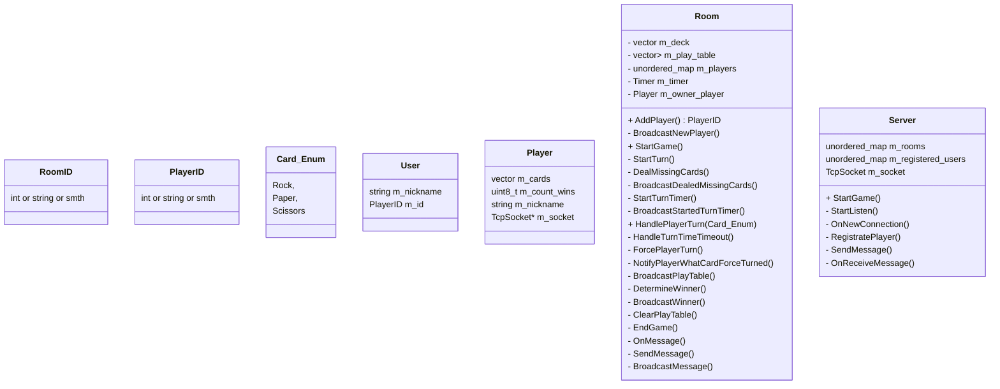

```mermaid
classDiagram
    class RoomID {
        int or string or smth
    }

    class PlayerID {
        int or string or smth
    }

    class Card_Enum {
        Rock,
        Paper,
        Scissors
    }

    class User {
        string m_nickname
        PlayerID m_id
    }

    class Player {
        vector<Cards> m_cards
        uint8_t m_count_wins
        string m_nickname
        TcpSocket* m_socket
    }

    class Room {
        + AddPlayer() PlayerID
        - BroadcastNewPlayer()

        + StartGame()
        
        - StartTurn()
        - DealMissingCards()
        - BroadcastDealedMissingCards()
        - StartTurnTimer()
        - BroadcastStartedTurnTimer()

        + HandlePlayerTurn(Card_Enum)

        - HandleTurnTimeTimeout()
        - ForcePlayerTurn() 
        - NotifyPlayerWhatCardForceTurned()
        - BroadcastPlayTable()
        - DetermineWinner()
        - BroadcastWinner()
        - ClearPlayTable()

        - EndGame()

        - OnMessage()
        - SendMessage()
        - BroadcastMessage()

        - vector<Cards> m_deck
        - vector<pair<PlayerID, Card_Enum>> m_play_table
        - unordered_map<PlayerID, Player> m_players 
        - Timer m_timer
        - Player m_owner_player
    }

    class Server {
        + StartGame()

        - StartListen()
        - OnNewConnection()

        - RegistratePlayer()

        - SendMessage()
        - OnReceiveMessage()

        unordered_map<RoomID, Room> m_rooms
        unordered_map<PlayerID, User> m_registered_users
        TcpSocket m_socket
    }
```
