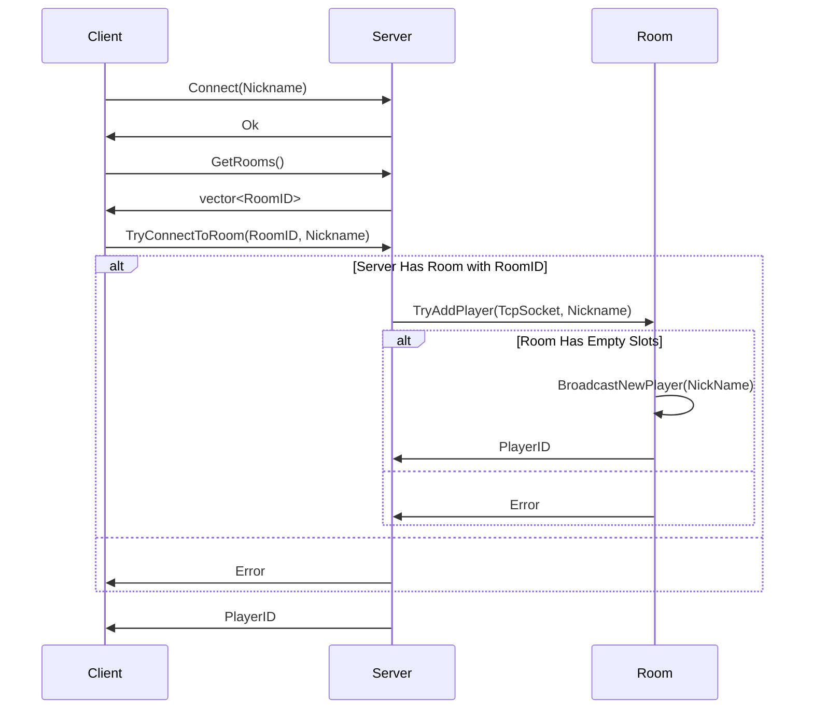

```mermaid
sequenceDiagram
    participant c as Client
    participant s as Server
    participant r as Room

    c->>s: Connect(Nickname)
    s->>c: Ok
    c->>s: GetRooms()
    s->>c: vector<RoomID>
    c->>s: TryConnectToRoom(RoomID, Nickname)
    alt Server Has Room with RoomID
        s->>r: TryAddPlayer(TcpSocket, Nickname)
        alt Room Has Empty Slots
            r->>r: BroadcastNewPlayer(NickName)
            r->>s: PlayerID
        else
            r->>s: Error
        end
    else 
        s->>c: Error
    end
    s->>c: PlayerID
```
