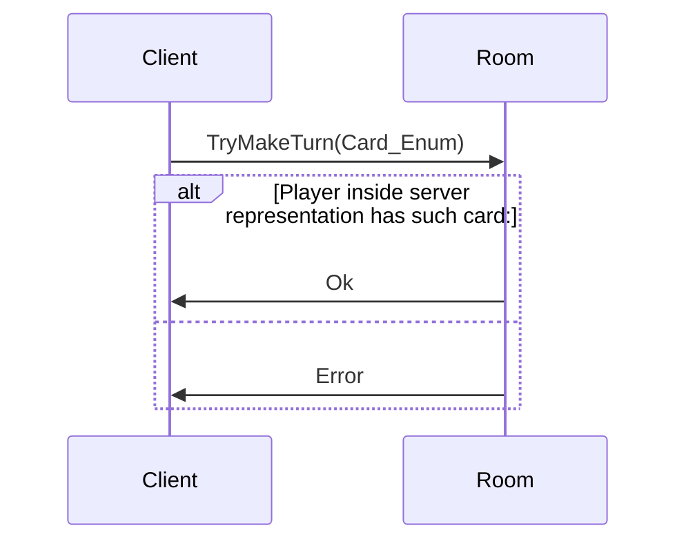

```mermaid
sequenceDiagram
    participant c as Client
    participant r as Room

    c->>r: TryMakeTurn(Card_Enum)
    alt Player inside server representation has such card:
        r->>c: Ok
    else
        r->>c: Error
    end
```
