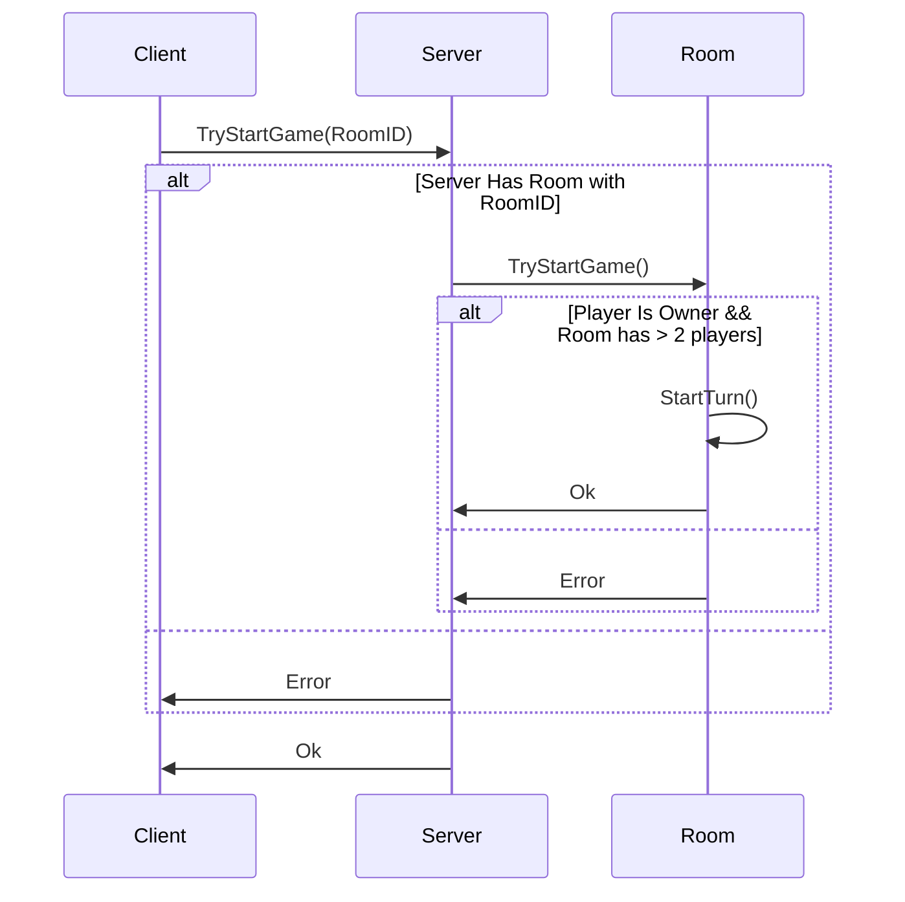

```mermaid
sequenceDiagram
    participant c as Client
    participant s as Server
    participant r as Room

    c->>s: TryStartGame(RoomID)
    alt Server Has Room with RoomID
        s->>r: TryStartGame()
        alt Player Is Owner && Room has > 2 players
            r->>r: StartTurn()
            r->>s: Ok
        else
            r->>s: Error
        end
    else
        s->>c: Error
    end
    s->>c: Ok
```
